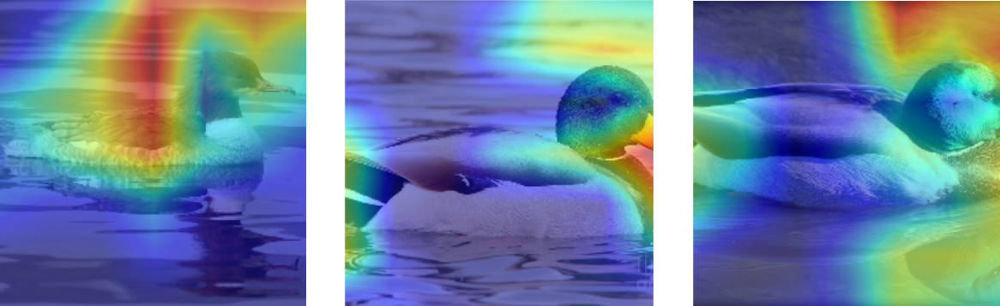

---
title: "Duck Species Identification using Convolutional Neural Networks"
author: "ANNEN Rayane, MARTINS Alexis"
date: "18.06.2023"
subtitle: "Apprentissage par réseaux de neurones artificiels"
lang: "en"
titlepage: true
titlepage-rule-color: "DA291C"
toc: true
toc-own-page: true
geometry: "top=2cm, bottom=2cm, left=2cm, right=2cm"
header-includes:
    - \usepackage{float}
    - \usepackage{subfig}
...

# Introduction

This project involves building an app to identify duck species using machine learning. 
We've gathered a diverse set of images from the web using a Python-based web scraper. 
To broaden our dataset, we applied data augmentation techniques like rotation and scaling. 
For processing, we're using Convolutional Neural Networks (CNNs) and transfer learning, which allow efficient and effective species recognition. 
This tool has potential uses in areas like ornithology and wildlife conservation.

# The problem

We are trying to learn to differentiate eight unique classes of ducks, comprised of seven species of male ducks and one specie of female ducks. 
The focus on male ducks arises from their vibrant and distinct coloration, in contrast to the more uniform brownish and greyish hues of females.

The dataset collected for this project is very balanced as all the classes have the same amount of images. 
For each of the eight classes, we have a total of 50 images (40 used for training and 10 for testing).
This amounts of 400 images in total, a manageable amount for detailed processing and analysis.

| Duck Species            | Training Images | Testing Images |
|-------------------------|-----------------|----------------|
| Allier White Duck       | 40              | 10             |
| Gadwall Duck            | 40              | 10             |
| Mallard Duck            | 40              | 10             |
| Mandarin Duck           | 40              | 10             |
| Northern Shoveler Duck  | 40              | 10             |
| Tufted Duck             | 40              | 10             |
| Whistling Duck          | 40              | 10             |
| Female Goosander        | 40              | 10             |

The intra-class diversity is relatively low, as all ducks within a specific class exhibit similar characteristics.
However, the inter-class similarity is also quite low. Each species of duck we have chosen exhibits unique color patterns, reducing the chances of misclassification between classes.
These two factors should allow the CNN to effectively learn the distinguishing features of each class and accurately identify the species of ducks in new unseen images.

# Data Preparation

The initial step in our data preparation involved resizing and rescaling the images.
To ensure compatibility with our model, we resized all images to a standard dimension of 224x224 pixels.

To enhance our dataset, we implemented data augmentation.
These techniques included transformations such as rotation, zooming, etc...
This process generated additional training samples.

Our dataset was split into two subsets: training and testing. 
We allocated 40 images from each class to the training set and the remaining 10 images to the test set, achieving an 80-20 split. 

# Model Creation

We decided to compare four different models to determine which one would be the most effective for our task.
The difference between the models are the variation of epochs and neurons per layer.
All the other parameters were constant for all the models because they were the most effective for our task.

## Hyperparameters exploration

We tried a lot of different hyperparameters and different models, we selected five models that we thought were the most different.
We mainly modified the number of epochs and the number of neurons per layer. All the other hyperparameters were constant for all the models and were the default values of the model given.
We also tried to add a dropout layer because we were curious about the results.
The five models are the following:

- Model 1: 5 epochs, 50 neurons per layer
- Model 2: 5 epochs, 250 neurons per layer
- Model 3: 5 epochs, 500 neurons per layer
- Model 4: 10 epochs, 50 neurons per layer
- Model 5: 5 epochs, 250 neurons per layer with a dropout layer of 10%

### Model 1

The problem with this first model is that on multiple runs, the consistency of the results varies a lot.
Sometimes the model has very good performances and sometimes it has very bad performances.
The images below are the results of an average run of the model.


\begin{figure}[H]
  \centering
  \captionsetup{justification=centering,margin=2cm}
  \subfloat[\centering Error graph]{
  \scalebox{0.45}{%
    \includegraphics{./figures/5epochs_50neurones.png}
  }}%
  \qquad
  \subfloat[\centering Confusion matrix]{
  \scalebox{0.45}{%
    \includegraphics{./figures/5epochs_50neurones_m.png}
  }}%
  \caption{Model with 5 epochs and 50 neurons in the dense layer}

\end{figure}

### Model 2

This model is one of the best models we tried. It has very good performances and it doesn't overfit as the complex models.

\begin{figure}[H]
  \centering
  \captionsetup{justification=centering,margin=2cm}
  \subfloat[\centering Error graph]{
  \scalebox{0.45}{%
    \includegraphics{./figures/5epochs_250neurones.png}
  }}%
  \qquad
  \subfloat[\centering Confusion matrix]{
  \scalebox{0.45}{%
    \includegraphics{./figures/5epochs_250neurones_m.png}
  }}%
  \caption{Model with 5 epochs and 250 neurons in the dense layer}

\end{figure}

### Model 3

The loss and the accuracy of the model are very good. But this model has a problem of overfitting, we notice near the fifth epochs the model starts to overfit by increasing its loss.

\begin{figure}[H]
  \centering
  \captionsetup{justification=centering,margin=2cm}
  \subfloat[\centering Error graph]{
  \scalebox{0.45}{%
    \includegraphics{./figures/5epochs_500neurones.png}
  }}%
  \qquad
  \subfloat[\centering Confusion matrix]{
  \scalebox{0.45}{%
    \includegraphics{./figures/5epochs_500neurones_m.png}
  }}%
  \caption{Model with 5 epochs and 500 neurons in the dense layer}

\end{figure}

### Model 4

This model has also good performances but it has overfit few times on multiple runs. Plus it is not really worth the effort to train this model comparing to a more simple model with less epochs.

\begin{figure}[H]
  \centering
  \captionsetup{justification=centering,margin=2cm}
  \subfloat[\centering Error graph]{
  \scalebox{0.45}{%
    \includegraphics{./figures/10epochs_50neurones.png}
  }}%
  \qquad
  \subfloat[\centering Confusion matrix]{
  \scalebox{0.45}{%
    \includegraphics{./figures/10epochs_50neurones_m.png}
  }}%
  \caption{Model with 10 epochs and 50 neurons in the dense layer}

\end{figure}

### Model 5

We tried to add dropout to our best model to see if it could improve the performances. But it didn't really change anything.
In fact, the model was even a little bit worse than the model without dropout.

\begin{figure}[H]
  \centering
  \captionsetup{justification=centering,margin=2cm}
  \subfloat[\centering Error graph]{
  \scalebox{0.45}{%
    \includegraphics{./figures/5epochs_250neurones_dropout.png}
  }}%
  \qquad
  \subfloat[\centering Confusion matrix]{
  \scalebox{0.45}{%
    \includegraphics{./figures/5epochs_250neurones_dropout_m.png}
  }}%
  \caption{Model with 5 epochs and 250 neurons in the dense layer with a dropout layer of 50\%}

\end{figure}

The model with the best accuracy was the model 2.

## Final model parameters

The final model uses the following hyper-parameters: :

- 5 epochs
- 250 neurons per layer
- 1 dense layer
- 32 batch size
- 0.001 learning rate
- Optimizer : RMSprop
- Activation function : ReLU
- Loss function : Sparse Categorical Cross-Entropy

## Transfer learning

We performed the transfer learning by freezing all the layers except the last one. 
We used transfer learning because it is a very effective technique to train a model with a small dataset. 
The model we used for transfer learning is the MobileNetV2 model. 
With this method, we had a very good model without having to train it for a long time and this is the main advantage of transfer learning.

# Results

## Confusion matrix and plots

\begin{figure}[H]
  \centering
  \captionsetup{justification=centering,margin=2cm}
  \subfloat[\centering Error graph]{
  \scalebox{0.45}{%
    \includegraphics{./figures/results_graph.png}
  }}%
  \qquad
  \subfloat[\centering Confusion matrix]{
  \scalebox{0.45}{%
    \includegraphics{./figures/results_matrix.png}
  }}%
  \caption{Final model with 5 epochs and 250 neurons in the dense layer}

\end{figure}

## F-score for each class

```
F1-score Male allier white duck : 1.0
F1-score Female goosander : 1.0
F1-score Male gadwall : 1.0
F1-score Male Mallard Duck : 1.0
F1-score Male Mandarin duck : 1.0
F1-score Male Northern shoveler : 0.9473684210526316
F1-score Male tufted duck : 0.9523809523809523
F1-score Male Whistling duck : 1.0

Model F1-score : 0.987468671679198
```

## Results after model evaluation

## Grad-cam analysis

First, let's analyze the features that the model focuses on to make its predictions.

- Mallard Duck: The focus is on the head and the beak of the duck. 
- Mandarin Duck: The model focuses on the head and the neck. It's understandable because the shape of their heads is quite unique.
- Whistling Duck: The focus is on the neck of the duck.
- Northern Shoveler Duck: The model focuses on the head and sometimes on their eyes. It is particular because it's not a regular black eye as the others.
- Allier White Duck: The model focuses on the head and the beak of the duck. This duck doesn't have any particular feature more than just being all white.
- Tufted Duck: Similarly to the northern shoveler duck, their eyes are very distinctive. The head is the main focus of the model for its black color and the eyes.
- Gadwall Duck: It seems to recognize it on an overall shape of the duck, in most part of the images the whole duck is in the focus of the model.
- Goosander Duck: It focuses on the head and the beak of the duck. The beak is particular in this duck and it should help the model to recognize it.


We noticed there are some image where the focus is not on the duck but rather on the background.

We think there are two main reasons:
 
 - the small number of examples
 - most examples show ducks in lakes or rivers

The model could have learned that the background is also important to classify the ducks.



## Misclassified images

When we tried different models there was mainly two cases that could happen.
 
 - Parts of mallard ducks example were misclassified as northern shoveler ducks and vice-versa. It could possibly come from their heads, they are similar colorwise.
 - This case was very rare compared to the second case which is having one particular image of a northern shoveler duck being misclassified as a tufted duck.

This image is the following :

\begin{figure}[H]
  \centering
  \captionsetup{justification=centering,margin=2cm}
  \subfloat[\centering Error graph]{
  \scalebox{0.45}{%
    \includegraphics{./figures/results_misclassified_1.png}
  }}%
  \qquad
  \subfloat[\centering Confusion matrix]{
  \scalebox{0.45}{%
    \includegraphics{./figures/results_misclassified_2.png}
  }}%
  \caption{Example of misclassified image}

\end{figure}

The only explanation we have is that the model confuses the eyes of the ducks. The eyes of the northern shoveler duck are comparable to the eyes of the tufted.

Plus with the grad-cam view, we observe the model focuses on the eye of the duck.

## Dataset improvement

We could improve the dataset by adding more examples:

 - More images: Having more ducks in the dataset with different angles and different backgrounds. Also we can think about different environments with for example less light, etc.
 - Cleaning watermarks and texts: it wasn't a problem for this particular case, but it could have been a problem if the model started to focus on the watermarks. The solution is to remove them from the images or remove the problematic images from the dataset.
 - Taking images directly ourselves instead of using the web: the images from internet are not always the best quality which can alter the performances of the model.

## Classes confusion

As said earlier, the model has a tendency to sometimes confuse the mallard duck with the northern shoveler duck. 
Also, it confuses the northern shoveler duck with the tufted duck for one specific image.

## TensorFlow Lite

The model works quite well, oftentimes we get the right classification. 

\begin{figure}[H]
  \centering
  \captionsetup{justification=centering,margin=2cm}
  \subfloat[]{
  \scalebox{0.30}{%
    \includegraphics{./figures/tflite_mallard.jpg}
  }}%
  \qquad
  \subfloat[]{
  \scalebox{0.30}{%
    \includegraphics{./figures/tflite_tufted.jpg}
  }}%
  \qquad
  \subfloat[]{
  \scalebox{0.30}{%
    \includegraphics{./figures/tflite_fgoosander.jpg}
  }}%
  \caption{Example of classified images with TensorFlow Lite}
\end{figure}

We still get sometimes classification errors with Mallard ducks and Northern Shovelers. 

\begin{figure}[H]
  \centering
  \captionsetup{justification=centering}
  \includegraphics[width=0.3\linewidth]{./figures/tflite_mallard_misclassified.jpg}
  \caption{Example of misclassified image with TensorFlow Lite}
\end{figure}

If we try to classify an unknown species the model will just try to find a class that fits best. We tried to classify a female mallard duck, which looks like a whistling duck in terms of colors.

\begin{figure}[H]
  \centering
  \captionsetup{justification=centering}
  \includegraphics[width=0.3\linewidth]{./figures/tflite_mallard_female.jpg}
  \caption{Female mallard duck labeled as a whistling duck}
\end{figure}

# Conclusion

In terms of performances the model is very good, it recognize our type of ducks in almost all the cases. 
We decided to keep the model simple as possible. It also reduces a lot the training time without necessarily altering the performances.
We could improve the model by adding more examples (as said earlier) and playing with the hyper-parameters more.

The model works very well on our use case because we intentionally chose ducks that are very different from each other. We focused on male ducks because they are more colorful and it's easier to recognize them.
Maybe if we also used the female ducks, our model would have been much less accurate because they are less colorful and all the female ducks look very similar.

We were very happy to work on this project. It was very interesting to see how we can create a model that can recognize images.
The fact of applying the theory we learned in class on a real project was very interesting and we learned a lot from it. 
We were very enthusiastic to try tricks such as transfer learning, data augmentation, dropout or even the grad-cam analysis.


